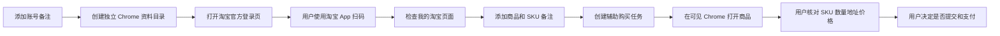

# 淘宝辅助购买工具 V2

一个面向 Windows 的淘宝辅助购买原型。项目提供账号隔离、淘宝 App 扫码登录、商品与任务管理、运行日志，以及在可见 Google Chrome 中打开商品和购物车的能力。

> 本项目定位为“人工确认的辅助购买工具”，不是无人值守抢购机器人。软件不会保存淘宝密码、不会处理或绕过验证码、不会伪造浏览器指纹、不会自动支付，最终提交由用户在淘宝官方页面确认。

## 功能

- 侧边导航式 Flet GUI
- SQLite 本地数据持久化
- 多账号本地管理
- 每个账号独立的 Chrome 用户资料目录
- 使用淘宝 App 扫码登录
- 商品链接、数量和 SKU 备注管理
- 辅助购买任务
- 在对应账号 Chrome 中打开商品或购物车
- 登录、商品、任务和异常日志
- 固定使用 Google Chrome，不调用系统默认 Edge
- 不需要 ChromeDriver 或 Selenium Manager

## 当前不包含

- 验证码或滑块自动处理
- Canvas、WebGL、UA 等浏览器指纹伪造
- 动态代理池或自动更换 IP
- 自动选择淘宝 SKU
- 自动点击最终“提交订单”
- 自动支付或保存支付信息
- 秒杀成功率保证

淘宝页面结构、库存、账号资格和平台风控都可能变化。任何自动化方案都不能保证成交或保证账号不受限制。

## 工作流程



## 实现原理

### 1. 账号隔离

每次添加账号时，程序会在本地 `data/profiles/` 创建一个随机命名的 Chrome 用户资料目录。Cookie、LocalStorage 和登录状态由真实 Chrome 自己管理，不会写入项目配置或 Git 仓库。

数据库的 `accounts` 表只保存：

- 本地账号备注
- Chrome 资料目录路径
- 登录状态
- 启用状态和更新时间

数据库中没有密码字段。

### 2. 扫码登录

扫码登录由 `src/safe_browser.py` 实现：

1. 查找本机正式版 `chrome.exe`。
2. 使用独立 `--user-data-dir` 启动可见 Chrome。
3. 打开淘宝官方登录页。
4. 用户自行使用淘宝 App 扫码和处理平台验证。
5. 点击“检查登录”时打开“我的淘宝”，仅根据页面是否跳回官方登录域名判断状态。

程序不会读取密码、二维码内容或 Cookie。

### 3. 本地状态端口

独立 Chrome 使用随机的本机调试端口。端口只绑定 `127.0.0.1`，用途是新建标签页并读取当前页面 URL，从而判断是否跳回登录页。它不上传浏览历史或登录数据。

### 4. 数据持久化

`src/v2_store.py` 使用 Python 标准库 `sqlite3`，数据库默认位于：

```text
data/taobao_assistant_v2.db
```

主要数据表：

- `accounts`：账号备注与独立资料目录
- `products`：商品链接、数量和 SKU 备注
- `tasks`：账号与商品组合的辅助购买任务
- `events`：登录、商品、任务和异常日志

`data/` 已加入 `.gitignore`，禁止提交本地登录状态。

## 环境要求

- Windows 10 或 Windows 11
- Python 3.10 及以上，建议 Python 3.12
- Google Chrome 正式版
- 能正常访问淘宝和 Python 包索引的网络

## 安装

```powershell
git clone https://github.com/SKTGAN/Taobao.git
cd Taobao

python -m venv .venv
Set-ExecutionPolicy -Scope Process Bypass
.\.venv\Scripts\Activate.ps1
python -m pip install --upgrade pip
python -m pip install -e .
```

## 启动

推荐方式：

```powershell
.\start-v2.ps1
```

脚本会：

1. 检查 8550 端口是否已经运行。
2. 只在未运行时启动 GUI 服务。
3. 明确使用 Google Chrome 打开一次页面，避免 Edge 和重复标签。

也可以手动启动：

```powershell
python main.py --no-browser --port 8550
```

然后用 Chrome 打开：

```text
http://127.0.0.1:8550
```

## 第一次使用

1. 进入“账号管理”。
2. 点击“添加账号”，只填写本地备注。
3. 点击“扫码登录”。
4. 在新 Chrome 窗口中使用淘宝 App 扫码。
5. 登录完成后回到 V2，点击“检查登录”。
6. 添加一个普通、低价商品进行验证。
7. 创建辅助任务并打开商品。
8. 在淘宝页面人工确认 SKU、数量、地址和价格。

建议先验证到购物车或确认订单页，不要直接使用高价或限量商品测试。

## 测试

```powershell
python -m unittest discover -s tests -p "test_*.py" -v
```

GitHub Actions 会在推送和 Pull Request 时使用 Python 3.12 运行测试。

## 项目结构

```text
Taobao/
├── main.py                  # 程序入口
├── start-v2.ps1            # Windows 单标签 Chrome 启动脚本
├── src/
│   ├── cli.py              # GUI 服务参数和入口
│   ├── gui_v2.py           # Flet 管理界面
│   ├── safe_browser.py     # 真实 Chrome 与扫码登录会话
│   ├── v2_store.py         # SQLite 数据层
│   └── paths.py            # 项目运行路径
├── tests/
│   └── test_v2_store.py
└── .github/workflows/
    └── tests.yml
```

## 隐私与安全

- 不要提交 `data/`、Chrome profile、SQLite 数据库或运行日志。
- 不要在 Issue、截图或日志中公开 Cookie、手机号、地址、订单号和支付信息。
- 遇到验证码、短信验证或账号保护页面时，请由账号本人在淘宝官方页面处理。
- 代理不是必需配置；能正常访问淘宝时应保持系统网络稳定，不要频繁切换出口。

## 后续计划

- 订单记录与 Excel 导出
- 商品和任务编辑/删除
- 登录失效提醒
- 任务到期桌面通知
- 更完善的错误提示和崩溃恢复
- 本地模拟商城与浏览器回归测试

真实平台能力将继续保持“可见浏览器、扫码登录、人工确认”的边界。

## 上游与许可证

本项目基于 [mc-yzy15/TaoBaoGoods](https://github.com/mc-yzy15/TaoBaoGoods) 的 Flet 项目结构进行重构，保留上游 GPL-3.0 许可要求。V2 重写了账号、数据存储、浏览器启动和 GUI 工作流，并移除了密码登录、指纹伪造及自动提交依赖。

项目采用 [GNU General Public License v3.0](LICENSE)。分发修改版或可执行文件时，请同时遵守 GPL-3.0 的源代码提供和许可证保留要求。

