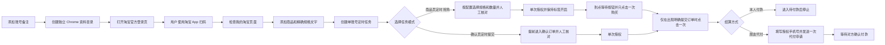

# 淘宝辅助购买工具 V2

一个面向 Windows 的淘宝辅助购买原型。当前阶段支持一个已扫码登录账号和一个运行中任务：用户提前配置商品、规格、数量、已有收货地址与结算方式并进行单次授权，程序按照淘宝 HTTPS 响应估算时间触发。本人付款任务进入待付款后停止；朋友代付任务只发送一次代付申请，最终付款仍由对方确认。

> 软件不会保存淘宝密码、不会处理或绕过验证码、不会伪造浏览器指纹，也不会自动完成付款。自动创建订单或发起朋友代付必须由用户针对当前任务显式授权；程序重启后授权自动失效。

## 使用边界与免责声明

- 本项目仅用于合法的技术学习、软件测试和账号本人进行的辅助购买，不是淘宝、天猫或支付宝官方软件，也不代表相关平台的认可或授权。
- 本项目不使用 MTOP 私有下单接口进行抢购，不提取、导入或重放浏览器 Cookie，不逆向或伪造私有签名、设备指纹及风控参数，也不绕过验证码、账号保护、限购、活动资格或其他访问控制。
- 禁止将本项目用于黄牛囤货、恶意抢购、虚假订单、未经授权操作他人账号、干扰平台服务、规避平台规则，或任何违反适用法律法规、平台服务协议、商家规则及活动规则的行为。
- 使用者必须只操作本人合法持有或已获得明确授权的账号，并自行保护账号、手机号、地址、订单和支付信息。不要将 Chrome Profile、Cookie、Token、数据库或日志分享给他人或提交到代码仓库。
- 淘宝页面、库存、活动资格、账号状态和风控规则可能随时变化。本项目不承诺能够抢到商品、成功创建订单、保持登录状态或避免平台限制；使用者应在提交订单前人工核对商品、规格、数量、地址和金额。
- 使用者应自行承担运行本项目产生的账号、订单、网络和合规风险。在适用法律允许的范围内，作者与贡献者不对误操作、账号限制、订单损失、数据泄露或其他直接、间接损失承担责任。
- “淘宝”“天猫”“支付宝”等名称及商标归其权利人所有。本项目仅以描述兼容对象为目的使用这些名称。

## 功能

- 侧边导航式 Flet GUI
- SQLite 本地数据持久化
- 多账号本地管理
- 每个账号独立的 Chrome 用户资料目录
- 使用淘宝 App 扫码登录
- 商品链接、数量和规格文字管理，支持编辑、复制、启用/停用和安全删除
- 规格文字使用 `|` 分隔，准备商品时逐项做唯一精确匹配并设置数量
- 账号支持新增、改名、启用/停用和安全删除；删除配置时默认保留 Chrome 登录资料
- 任务支持编辑和删除；编辑后原授权自动失效，失败原因直接显示在任务状态下方
- 可打开淘宝官方地址管理页新增/修改地址，任务用识别词唯一选择已经保存的地址
- 可选择朋友代付并配置支付宝绑定手机号，订单创建后只填写并发送一次代付申请
- 概览页显示淘宝 HTTPS `Date` 响应估算时间、与本机偏差及网络往返时间；调度使用该偏差
- 支持粘贴 `m.tb.cn`、`e.tb.cn` 官方短链或包含短链的淘宝分享文本
- 毫秒级计划时间和单账号定时任务
- 商品页、登录页、确认订单页、验证页和待付款页识别
- `商品页定时抢购`：准备时按配置精确选择规格并设置数量，用户目视核对后保持商品页开启；到点后在本地页面中最多等待按钮 15 秒，只点击一次购买，再只点击一次明确的“提交订单”
- `确认页定时提交`：提前进入确认订单页，用户核对地址、价格和协议选项后授权；到点只点击已经核对过的“提交订单”
- 本人付款模式遇到“免密支付”“立即支付”等可能直接扣款的动作立即停止
- 购买和提交动作要求唯一按钮且各只点击一次；授权变化、停止请求或标签失效时立即中止
- 检测常见 Windows/环境变量代理，并在最终授权前要求用户确认已关闭代理/VPN
- 任务停止、失败原因和运行日志
- 应用重启后通过 `DevToolsActivePort` 重新连接账号 Chrome
- 登录、商品、任务和异常日志
- 固定使用 Google Chrome，不调用系统默认 Edge
- 不需要 ChromeDriver 或 Selenium Manager

## 当前不包含

- 验证码或滑块自动处理
- Canvas、WebGL、UA 等浏览器指纹伪造
- 动态代理池或自动更换 IP
- MTOP 私有下单接口、签名协议逆向或 Cookie 请求重放
- 自动发现和枚举淘宝页面上的全部 SKU 选项（当前由用户填写页面上可见的精确规格文字，或粘贴已经带 `skuId` 的链接）
- 自动支付，或保存支付密码、银行卡等支付凭据
- 自动新增/修改完整收货地址表单（请在淘宝官方地址管理页人工完成）
- 多账号并发、多商品组合和无限重试
- 秒杀成功率保证

淘宝页面结构、库存、账号资格和平台风控都可能变化。任何自动化方案都不能保证成交或保证账号不受限制。

## 工作流程


```mermaid
flowchart LR
    A[添加账号备注] --> B[创建独立 Chrome 资料目录]
    B --> C[打开淘宝官方登录页]
    C --> D[用户使用淘宝 App 扫码]
    D --> E[检查我的淘宝页面]
    E --> F[添加商品和精确规格文字]
    F --> G[创建单账号定时任务]
    G --> H{选择任务模式}
    H -->|商品页定时抢购| I[按配置选择规格和数量并人工核对]
    I --> J[单次授权并保持标签开启]
    J --> K[到点等待按钮并只点击一次购买]
    H -->|确认页定时提交| L[提前进入确认订单并人工核对]
    L --> M[单次授权]
    K --> N[仅在出现明确提交订单时点击一次]
    M --> N
    N --> O{结算方式}
    O -->|本人付款| P[进入待付款后停止]
    O -->|朋友代付| Q[填写授权手机号并发送一次代付申请]
    Q --> R[等待对方确认付款]
```

## 实现原理

### 1. 账号隔离

每次添加账号时，程序会在当前 Windows 用户的通用数据目录下创建一个随机命名的 Chrome 用户资料目录。Cookie、LocalStorage 和登录状态由真实 Chrome 自己管理，不会写入项目配置或 Git 仓库。

数据库的 `accounts` 表只保存：

- 本地账号备注
- Chrome 资料目录路径
- 登录状态
- 启用状态和更新时间

数据库中没有密码字段。

### 2. 扫码登录

扫码登录由 `src/safe_browser.py` 实现：

1. 查找本机正式版 `chrome.exe`。
2. 使用独立 `--user-data-dir` 启动可见 Chrome。
3. 打开淘宝官方登录页。
4. 用户自行使用淘宝 App 扫码和处理平台验证。
5. 点击“检查登录”时打开“我的淘宝”，仅根据页面是否跳回官方登录域名判断状态。

程序不会读取密码、二维码内容或 Cookie。

### 3. 本地状态端口

独立 Chrome 使用随机的本机调试端口。端口只绑定 `127.0.0.1`，用途是新建标签页并读取当前页面 URL，从而判断是否跳回登录页。它不上传浏览历史或登录数据。

### 4. 数据持久化

`src/v2_store.py` 使用 Python 标准库 `sqlite3`。默认数据目录与项目代码分离，数据库位于：

```text
%LOCALAPPDATA%\TaobaoAssistant\taobao_assistant_v2.db
```

配置文件、Chrome 资料、服务日志也位于 `%LOCALAPPDATA%\TaobaoAssistant\`。因此项目可放在任意磁盘或中文目录，更新代码时不会覆盖登录资料。可通过环境变量 `TAOBAO_ASSISTANT_DATA_DIR` 改为其他目录。

旧版本如果存在项目内的 `data/taobao_assistant_v2.db`，首次启动会把数据库和账号 Chrome 资料复制到通用数据目录，并更新数据库中的资料路径。旧目录会保留作为备份，不会自动删除。

主要数据表：

- `accounts`：账号备注与独立资料目录
- `products`：商品链接、数量和精确规格文字
- `tasks`：账号与商品组合的辅助购买任务、本次规格与数量、地址识别词及朋友代付配置
- `events`：登录、商品、任务和异常日志

`data/` 已加入 `.gitignore`，禁止提交本地登录状态。

## 环境要求

- Windows 10 或 Windows 11
- Python 3.10 及以上，建议 Python 3.12
- Google Chrome 正式版
- 能正常访问淘宝和 Python 包索引的网络

## 一键安装（交付推荐）

1. 安装 64 位 Python 3.10 或更高版本，安装时勾选 **Add Python to PATH**。
2. 安装 Google Chrome 正式版。
3. 解压项目后，双击 `install-and-start.cmd`。

脚本会自动创建 `.venv`、安装依赖、初始化通用数据目录并启动程序。第一次安装需要能访问 Python 包索引；以后直接双击 `start-v2.ps1` 即可。

详细交付步骤见 [`docs/delivery-guide.md`](docs/delivery-guide.md)。

## 手动安装

```powershell
git clone https://github.com/SKTGAN/Taobao.git
cd Taobao

python -m venv .venv
Set-ExecutionPolicy -Scope Process Bypass
.\.venv\Scripts\Activate.ps1
python -m pip install --upgrade pip
python -m pip install -e .
```

## 启动

推荐方式：

```powershell
.\start-v2.ps1
```

更新代码后要确保旧的后台服务退出并加载新版本，可运行：

```powershell
.\start-v2.ps1 -Restart
```

脚本会：

1. 从 `%LOCALAPPDATA%\TaobaoAssistant\config.json` 读取 Chrome 路径和服务端口。
2. 端口被其他程序占用时，自动选择一个临时空闲端口。
3. 在后台启动 GUI 服务，并把输出写入通用数据目录。
4. 明确使用 Google Chrome 打开页面，避免系统默认打开 Edge。

也可以手动启动：

```powershell
python main.py --no-browser --port 8550
```

然后用 Chrome 打开：

```text
http://127.0.0.1:8550
```

## 第一次使用

1. 程序会自动检查 Windows、Python、数据目录、Google Chrome、端口以及淘宝/支付宝 HTTPS 连接。
2. 如果检测到代理配置，先关闭代理/VPN，再重新运行环境自检。TUN/隧道型 VPN 可能无法自动识别，需要自行确认。
3. 如果有其他未通过项，进入“设置”查看原因；也可手动填写 `chrome.exe` 完整路径和本地端口。
4. 进入“账号管理”，点击“添加账号”，只填写本地备注。
5. 点击“扫码登录”，在新 Chrome 窗口中使用淘宝 App 扫码。
6. 登录完成后回到 V2，点击“检查登录”。
7. 添加一个普通、低价商品进行验证；可以直接粘贴淘宝分享文本，程序会提取其中的官方短链。
8. 在概览页点击“同步淘宝时间”。显示“已同步”、偏差和 RTT 后再创建任务；HTTP `Date` 只有秒级分辨率，因此这里是网络时间估算，不是淘宝内部毫秒接口。
9. 创建任务并选择模式；抢购、秒杀或到点才开放购买的商品选“商品页定时抢购”，普通可提前购买的商品可选“确认页定时提交”。计划时间按照界面显示的淘宝估算时间填写。
10. 若要指定地址，先在账号管理点击“地址管理”，在淘宝官方页面新增或修改；任务中填写足够唯一的地址识别词，例如“收件人姓名 + 手机尾号”。
11. 若选择朋友代付，填写对方支付宝绑定的 11 位手机号。授权时必须再次确认；软件不会把完整手机号写入日志，也不会替代对方付款。
12. 点击“准备商品”。若商品没有固定 `skuId`，程序会按照商品配置中的 `黑色 | 256GB` 等文字逐项精确选择并设置数量；找不到、同名多个或数量设置失败都会停止并标注原因。
13. “商品页定时抢购”：目视确认程序选中的 SKU 和数量，保持页面和软件开启，再授权。到点无需再手动点击，程序只检查已打开页面的 DOM，购买按钮出现后最多等待 15 秒并只点击一次。
14. “确认页定时提交”：程序提前进入确认订单页并应用已有地址/朋友代付配置；人工核对地址、价格、数量、号码保护和协议选项后，再点击“核对后授权”。
15. 本人付款任务只有页面出现唯一、明确、可用的“提交订单”时才继续；“免密支付/立即支付”会停止。朋友代付任务只接受唯一的“找朋友帮忙付/提交订单”，进入官方代付页后填写手机号并只发送一次“请他付款”。
16. 到点后不要关闭绑定的账号 Chrome 标签或切换页面。本人付款进入“待付款”后停止；朋友代付显示“代付待确认”后由对方在官方页面完成。

首次真实验证请使用你自己的普通低价商品，并全程看着 Chrome。出现验证码、风控或页面结构变化时，任务会转为“需人工处理”。

## 测试

```powershell
python -m unittest discover -s tests -p "test_*.py" -v
```

本地真实 Chrome 模拟结算回归测试（只访问 `127.0.0.1`，不会访问淘宝）：

```powershell
$env:RUN_BROWSER_TESTS = "1"
python -m unittest tests.test_browser_checkout_flow -v
```

GitHub Actions 会在推送和 Pull Request 时使用 Python 3.12 运行测试。

## 项目结构

```text
Taobao/
├── main.py                  # 程序入口
├── install-and-start.cmd    # 接收方双击的一键安装入口
├── install.ps1              # 创建环境、安装依赖和初始化数据
├── start-v2.ps1             # 读取配置并启动 Chrome/服务
├── src/
│   ├── app_config.py       # 用户级 Chrome/端口配置
│   ├── environment_check.py # 首次运行环境自检
│   ├── cli.py              # GUI 服务参数和入口
│   ├── gui_v2.py           # Flet 管理界面
│   ├── cdp_client.py       # 本机 Chrome DevTools 通道
│   ├── page_automation.py  # 页面识别和有限点击动作
│   ├── safe_browser.py     # 真实 Chrome、扫码登录和会话重连
│   ├── taobao_time.py      # 淘宝 HTTPS Date 时间偏差估算
│   ├── task_runner.py      # 单账号定时提交状态机
│   ├── v2_store.py         # SQLite 数据层
│   └── paths.py            # 通用数据路径与旧数据迁移
├── tests/
│   ├── mock_shop/          # 仅本机使用的模拟商品/结算页面
│   └── test_*.py
└── .github/workflows/
    └── tests.yml
```

## 隐私与安全

- 不要提交 `data/`、Chrome profile、SQLite 数据库或运行日志。
- 不要在 Issue、截图或日志中公开 Cookie、手机号、地址、订单号和支付信息。
- 朋友代付手机号会保存在本机 SQLite 任务配置中以便定时使用，界面列表只显示掩码，运行日志不记录完整号码；不需要此功能时请关闭并编辑任务清空。
- 遇到验证码、短信验证或账号保护页面时，请由账号本人在淘宝官方页面处理。
- 真实淘宝操作不需要代理；优先使用账号平时常用的中国大陆家庭宽带或本人手机热点。
- 不要为多个账号频繁轮换代理、IP 或地区。程序不会提供代理池、IP轮换、随机UA、Cookie轮换或指纹伪造。
- 更换普通网络后应重新扫码或检查登录，并先做一次人工浏览验证；任务运行期间不要切换网络出口。

## 可移植配置

设置页可以保存 Chrome 路径和端口。高级交付场景也可在启动前设置：

```powershell
$env:TAOBAO_ASSISTANT_DATA_DIR = "D:\TaobaoAssistantData"
$env:TAOBAO_ASSISTANT_CHROME = "D:\Apps\Chrome\Application\chrome.exe"
$env:TAOBAO_ASSISTANT_PORT = "9000"
.\start-v2.ps1
```

优先级为：启动参数或环境变量 > `%LOCALAPPDATA%\TaobaoAssistant\config.json` > 自动探测/默认值。登录资料包含敏感会话信息，不应在不同人员之间复制；每位接收者应在自己的电脑上重新扫码登录。

## 后续计划

- 订单记录与 Excel 导出
- 对不同淘宝页面版本维护更多规格、地址和代付选择器回归样本
- 登录失效提醒
- 任务到期桌面通知
- 页面选择器的版本化适配与更多回归样本
- 在单账号流程稳定后再评估多账号和多商品组合

真实平台能力将继续保持“可见浏览器、扫码登录、人工核对、单次授权、不自动支付”的边界。

## 上游与许可证

本项目基于 [mc-yzy15/TaoBaoGoods](https://github.com/mc-yzy15/TaoBaoGoods) 的 Flet 项目结构进行重构，保留上游 GPL-3.0 许可要求。V2 重写了账号、数据存储、浏览器启动和 GUI 工作流，并移除了密码登录与指纹伪造依赖。

项目采用 [GNU General Public License v3.0](LICENSE)。分发修改版或可执行文件时，请同时遵守 GPL-3.0 的源代码提供和许可证保留要求。

